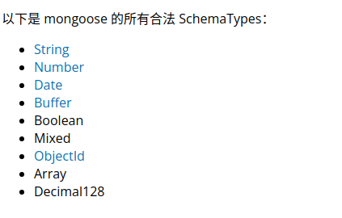
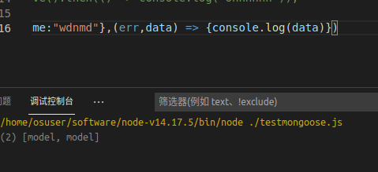
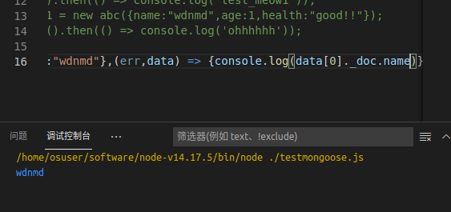

# 一.mongoose使用

### 1.安装

​		创建js项目后，安装mongoose：npm install mongoose --save

​		要求已经安装并启动mongodb数据库服务器

### 2.使用流程

​	1）引入mongoose：

​		const mongoose = require('mongoose');

​	2）连接数据库：

​		mongoose.connect('mongodb://localhost/test');             test为数据库名，可更改

​	3）创建一个schema：

​		const schema = {

   		 name:String,
   	
   		 age:Number,
   	
   		 health:String

​		}

​		schema只有在创建model时引用起作用。

​		mongoose创建有自己的数据类型定义：

​		创建的schema生效后，存储到数据库的数据必须遵守，否则不能存储，但系统没有原生的错误提示，知识存储一个空数据。

​	4）创建一个model：

​		const Cat = mongoose.model('Cat', schema);

​	5）实例化这个model：

​		const kitty1 = new Cat({name:"wdnmd",age:1,health:"good!!"});

​	6）写入数据库：

​		kitty1.save().then(() => console.log('ohhhhhh'));

##### 		写入后数据集的名称:是定义的model的第一个参数，并且会变为小写复数形式（没有的话）

##### 		所以，之后命名方式就直接写为小写复数形式就可以了

​	7）数据查询：

​		数据集.find({查询条件}，callback(err,查询结果) => {} )

​		查询结果是一个array	

​		可通过数据位置选择出来